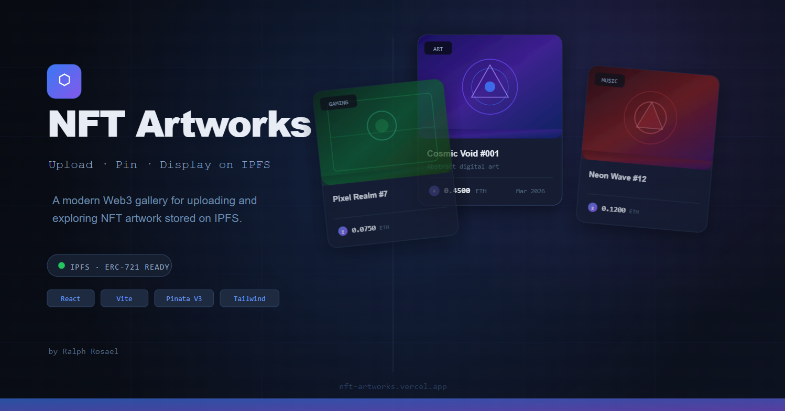

# NFT Artworks (Improved UI/UX, Pinata V3)

A modern Web3 NFT gallery application. Upload NFT images to IPFS via Pinata, generate ERC-721 compatible metadata with ETH pricing, and explore a responsive gallery powered directly by IPFS.

> Built with React + Vite · Pinata V3 + Legacy Pinning · Public IPFS · Vercel-ready

---

## Demo

[](public/project-demo.mp4)

---

## 🚀 Features

### IPFS Upload via Pinata
- Images → Pinata V3 (`/v3/files`)
- Metadata → `pinJSONToIPFS` (legacy)
- Stored permanently on **public IPFS**

### ERC-721 Compatible Metadata
- Includes name, description, category, and ETH price
- Stored entirely on IPFS (no database)

### Dynamic Gallery (No localStorage dependency)
- NFTs fetched from Pinata (`/data/pinList`)
- Works across devices and browsers

### Advanced Filtering
- Search by name/category
- Filter by category
- Sort: newest, oldest, price ↑↓

### Image Preview Modal
- Click-to-zoom
- Direct metadata link (IPFS)

### Dark / Light Theme
- Persisted in localStorage (UI only)

### Secure Backend Proxy
- `PINATA_JWT` never exposed to browser

### Vercel-Ready
- Serverless `/api` routes included

---

## 🧱 Tech Stack

| Layer      | Technology                          |
|------------|-----------------------------------|
| Frontend   | React 18 + Vite 5                 |
| Styling    | TailwindCSS + CSS variables       |
| Animation  | Framer Motion                     |
| Toasts     | react-hot-toast                   |
| IPFS       | Pinata V3 + pinJSONToIPFS         |
| Backend    | Express / Vercel Functions        |
| HTTP       | axios                             |
| Storage    | IPFS (Pinata as source of truth)  |

---

## 📁 Project Structure

```

nft-artworks
├── api/
│   ├── nfts.js
│   ├── upload-image.js
│   └── upload-metadata.js
├── public/
│   ├── apple-touch-icon.svg
│   ├── favicon.svg
│   └── nft-artworks-og.svg
├── src/
│   ├── components/
│   │   ├── CategoryFilter.jsx
│   │   ├── ImageCard.jsx
│   │   ├── ImagePreviewModal.jsx
│   │   ├── Loader.jsx
│   │   ├── Navbar.jsx
│   │   ├── SearchBar.jsx
│   │   └── UploadModal.jsx
│   ├── hooks/
│   │   └── useUpload.js
│   ├── pages/
│   │   ├── Docs.jsx
│   │   └── Gallery.jsx
│   ├── services/
│   │   └── pinataService.js
│   ├── utils/
│   │   ├── metadataBuilder.js
│   │   └── storage.js
│   ├── App.jsx
│   ├── index.css
│   └── main.jsx
├── .env.example
├── .gitignore
├── index.html
├── LICENSE
├── package-lock.json
├── package.json
├── postcss.config.js
├── README.md
├── server.cjs
├── tailwind.config.js
├── vercel.json
└── vite.config.js

````

---

## ⚙️ Local Setup

### Requirements
- Node.js ≥ 18  
- npm ≥ 9  
- Pinata account  

---

### 1. Install

```bash
npm install
````

---

### 2. Configure environment

```bash
cp .env.example .env
```

```env
PINATA_JWT=your_pinata_jwt
PINATA_GATEWAY=your-gateway.mypinata.cloud
VITE_PINATA_GATEWAY=your-gateway.mypinata.cloud
API_PORT=3001
```

---

### 3. Run locally

**Terminal 1**

```bash
node server.cjs
```

**Terminal 2**

```bash
npm run dev
```

Open:

```
http://localhost:5173
```

---

## 🔐 Environment Variables

| Variable              | Description                       |
| --------------------- | --------------------------------- |
| `PINATA_JWT`          | Server-side Pinata authentication |
| `PINATA_GATEWAY`      | Gateway for building IPFS URLs    |
| `VITE_PINATA_GATEWAY` | Same gateway (frontend use)       |
| `API_PORT`            | Local API server port             |

> `PINATA_JWT` is never exposed to the browser.

---

## 🔑 Pinata API Key Setup

Create key at: [https://app.pinata.cloud/keys](https://app.pinata.cloud/keys)

### Required permissions:

#### V3

* **Files → Write** ✅

#### Legacy

* **pinJSONToIPFS** ✅
* **pinList** ✅

---

## 🔄 Upload Flow

```
Image Upload:
Browser → /api/upload-image → Pinata V3 (/v3/files)

Metadata Upload:
Browser → /api/upload-metadata → pinJSONToIPFS

Gallery:
Browser → /api/nfts → Pinata /data/pinList → fetch metadata JSON
```

---

## 🧠 Architecture Notes

* **Pinata = source of truth**
* No database required
* No reliance on localStorage for NFT data
* All NFTs persist across:

  * refresh
  * devices
  * browsers

---

## 🚀 Deployment (Vercel)

1. Import repo in Vercel

2. Set:

   * Framework: Vite
   * Build: `npm run build`
   * Output: `dist`

3. Add environment variables:

   * `PINATA_JWT`
   * `PINATA_GATEWAY`
   * `VITE_PINATA_GATEWAY`

4. Deploy

---

## ✅ Verification Checklist

```
[ ] Upload image → returns CID
[ ] Upload metadata → returns CID
[ ] NFT appears in gallery
[ ] Refresh → NFT still exists
[ ] Open on phone → same NFTs visible
[ ] Pinata dashboard shows files
[ ] No JWT exposed in browser
```
---

## DevChallenge · Pinata Challenge

This project was built as part of the [Pinata Challenge](https://dev.to/challenges/pinata), focusing on decentralized storage using IPFS.

🔗 [Read the full post](https://dev.to/coderralph/creating-nft-artworks-with-pinata-4c9k)

> Note: This version improves the original submission by adding NFT metadata, pricing, and a fully IPFS-powered gallery instead of image-only uploads.

---

## 📄 License

This project is open-sourced software licensed under the [MIT license](https://opensource.org/licenses/MIT).

---

<div align="center">
  Made with ❤️ and ☕ by Ralph Rosael
</div>
